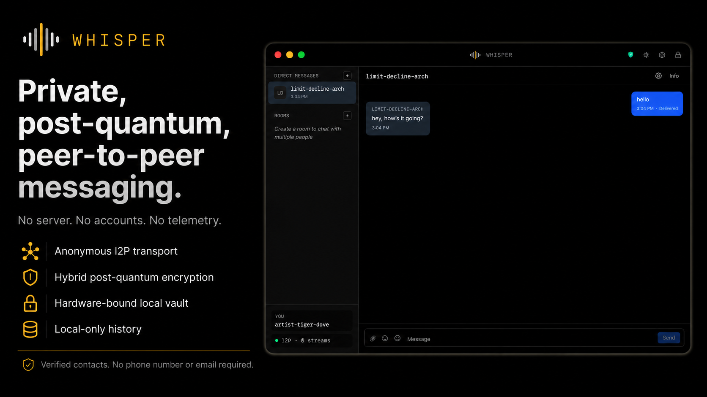
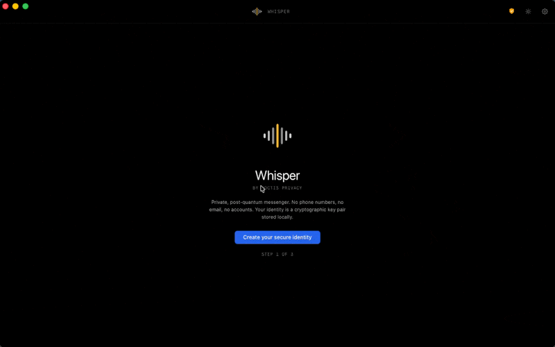

# Whisper by Noctis Privacy

<p align="center">
  
</p>

A private, post-quantum, **decentralized** peer-to-peer messenger for macOS.

No central server, no operator-run relay, no directory authority anyone
can subpoena. The transport is **I2P** — a fully decentralized, garlic-
routed overlay network whose router directory (NetDB) is itself a
peer-to-peer DHT, so there is no global registry of users to enumerate.
Peers connect directly to each other through anonymous tunnels built
across that mesh.
Cryptography is hybrid post-quantum and every session is protected by both
classical X25519 and ML-KEM-1024, so an attacker has to break both legs
to recover a key. Local storage is SQLCipher anchored to a hardware-bound
seed in the macOS Keychain (`kSecAttrAccessibleWhenUnlockedThisDeviceOnly`,
non-syncable). A clone of the database file on another machine cannot be
opened without the original Mac's Keychain.

For the architecture and the threat model, see
[`WHITEPAPER.md`](WHITEPAPER.md). For the high-level version, see
[`LITEPAPER.md`](LITEPAPER.md).

<p align="center">
  
</p>

## Install

Apple Silicon Macs running macOS 12+. Single command — Homebrew will
auto-tap on the fully-qualified cask reference:

```sh
brew install --cask jetp1ane/noctis-whisper/noctis-whisper
```

Builds from v0.1.3 onward are signed with an Apple Developer ID and
notarized by Apple's notary service, so Gatekeeper opens the app
cleanly even on direct-`.dmg` downloads. (The shorter `brew install
--cask noctis-whisper` form will work after submission to
homebrew/homebrew-cask clears review.)

## Status

**v1.0.0** — first stable release, available via Homebrew Cask.

Whisper has been through multiple rounds of independent security
review covering the cryptographic protocol, the local SQLCipher vault,
transport-layer integrity, and platform hardening. Findings were
remediated and the fixes are covered by regression tests that run on
every push.

Distribution: signed with an Apple Developer ID and notarized by
Apple's notary service, with macOS Hardened Runtime and App Sandbox
both in force. Direct `.dmg` downloads pass Gatekeeper cleanly.

## Stack

- **Backend:** Rust (Tauri v2) — crypto, I2P transport, SQLCipher, macOS
  Keychain glue
- **Frontend:** React + TypeScript + Tailwind, single window, dark/light
- **Database:** SQLCipher 4 via `rusqlite` with `bundled-sqlcipher`
- **Crypto:**
  - X25519 (`x25519-dalek`), Ed25519 (`ed25519-dalek`)
  - ML-KEM-1024 (`pqcrypto-mlkem`) for hybrid post-quantum key exchange
  - ChaCha20-Poly1305 (`chacha20poly1305`) AEAD
  - HKDF-SHA256, BLAKE2b, Argon2id (256 MiB / 4 iter / 4 lanes)
  - All key buffers wrapped in `zeroize`
- **Transport:** bundled `i2pd` subprocess on a randomized SAM port,
  destination minted at first vault unlock and persisted in SQLCipher.

## Project layout

```
src-tauri/src/
  crypto/         keys, vault, pqx3dh, ratchet, message_crypto,
                  sender_key, sealed, secure_enclave, safety_numbers,
                  config_manifest, bundle, seed
  transport/
    i2p/          manager (i2pd lifecycle), sam (SAM v3 client),
                  connection, framing, queue, dispatch, lifecycle,
                  destination, runtime
    mailbox.rs    BLAKE2b mailbox addressing
    envelopes.rs  signed-bundle wire format
  messaging/      inbound, sender, receiver, ratchet_store, room_keys,
                  attachments
  db/             schema, contacts, messages, rooms, identity
  security/       egress audit (lsof of own + i2pd subprocess)
  identity.rs     identity load / persist
  state.rs        AppState (vault runtime + i2p slots)
  commands.rs     Tauri IPC surface
  lib.rs          app entrypoint, tray, pre-warm task

src-tauri/tests/
  otpk_race.rs    one-time prekey zeroize + retransmission guards
  parser_fuzz.rs  envelope parser fuzzing (~85k inputs)
  ...

src/
  components/     layout, chat, contacts, rooms, vault, settings, shared
  hooks/          useCrypto, useKeyboard, useVault, useMessages
  stores/         appStore, conversationStore (Zustand)

scripts/
  bundle-i2pd.sh  prepares src-tauri/i2pd-bundle/ from Homebrew i2pd
  dev-dual.sh     launches two profile-isolated dev instances
  wipe-profile.sh resets a profile to first-launch state
  release.sh      builds + writes a populated Homebrew Cask file

homebrew/
  noctis-whisper.rb   source-of-truth Cask, copied into the tap repo
                      per release

docs/
  HOMEBREW.md     one-time tap setup + per-release flow

WHITEPAPER.md     architecture, threat model, cryptographic detail
LITEPAPER.md     condensed pitch + diagrams
```

## Development

```sh
brew install i2pd                      # required by scripts/bundle-i2pd.sh
npm install
npm run tauri:dev                      # single instance (default profile)
./scripts/dev-dual.sh                  # two instances (default + alice)
```

Requirements:

- Rust 1.77+ (`cargo`)
- Node 22+ (`npm`)
- Xcode Command Line Tools
- Homebrew (for `i2pd`)

The dual-instance script kills any prior Whisper / orphan i2pd
processes, pre-builds the debug binary, and sequentially launches
both instances so they don't race on `pick_free_port`.

To reset a profile to first-launch state (testing onboarding /
recovery-from-seed):

```sh
./scripts/wipe-profile.sh default     # one profile
./scripts/wipe-profile.sh --all       # default + alice + bob
```

## Tests

```sh
cd src-tauri
cargo test --lib                                           # 104 unit tests
cargo test --test otpk_race                                # 3 integration
cargo test --test parser_fuzz --release                    # 4 fuzz, ~85k inputs
cargo test --lib --release                                 # 104 + tampering test
```

The release-only `verify_i2pd_pin_catches_dylib_tampering` test
mutates a copy of the bundle and asserts the pin verification rejects
both byte-tampered dylibs and tampered reseed certs by name.

CI runs all of the above on every push and pull request — see
`.github/workflows/ci.yml`.

## Releasing

See [`docs/HOMEBREW.md`](docs/HOMEBREW.md). Per release:

```sh
./scripts/release.sh
```

Outputs a built `.dmg` and a populated `homebrew/noctis-whisper.rb`
ready to commit into your tap repo. Users install with one command —
brew auto-taps from the fully-qualified cask reference:

```sh
brew install --cask jetp1ane/noctis-whisper/noctis-whisper
```

(The shorter `brew install --cask noctis-whisper` form will work after
submission to homebrew/homebrew-cask clears review.)

## Security disclosure

If you've found a vulnerability, please open a private security
advisory on this repo rather than a public issue.

## License

MIT — see [`LICENSE`](LICENSE).
